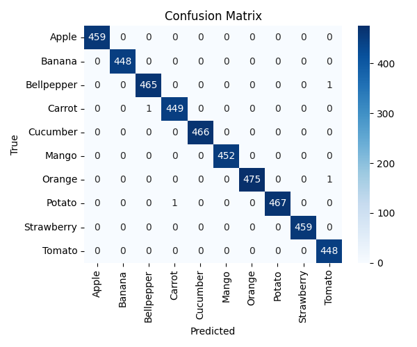
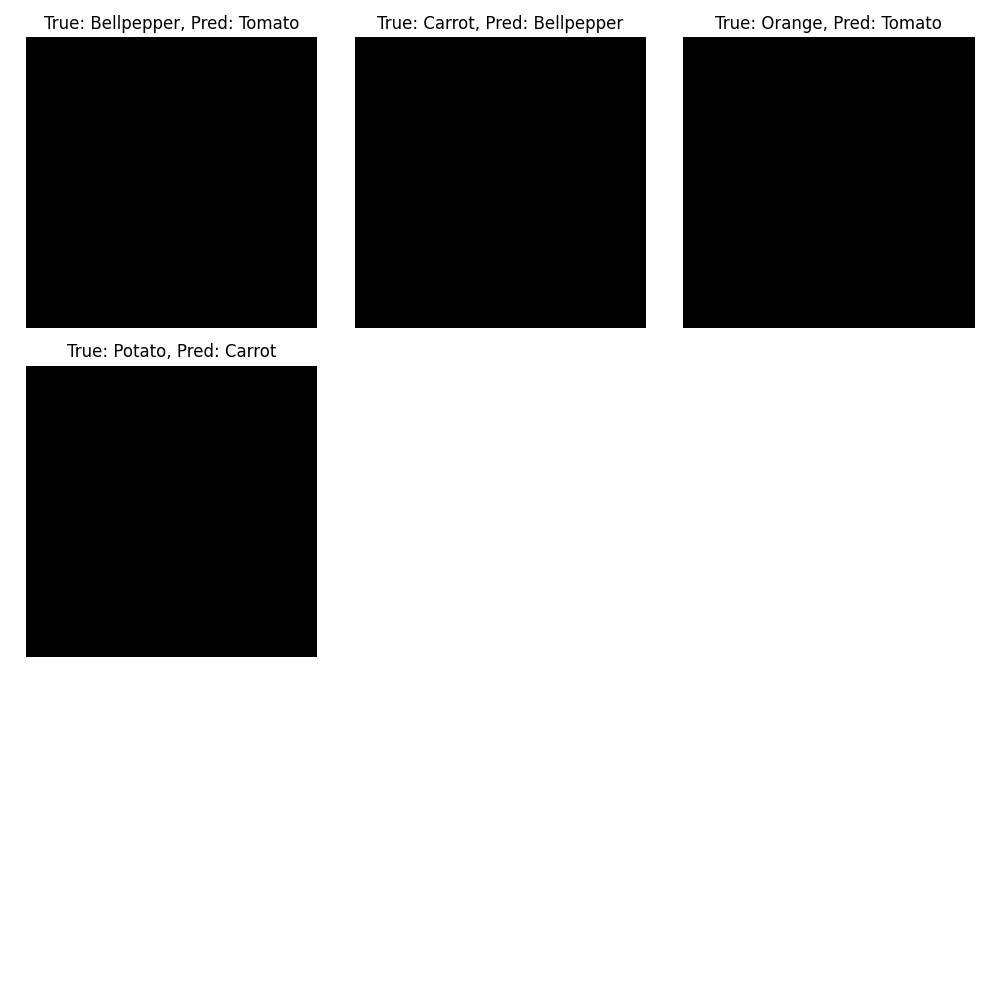
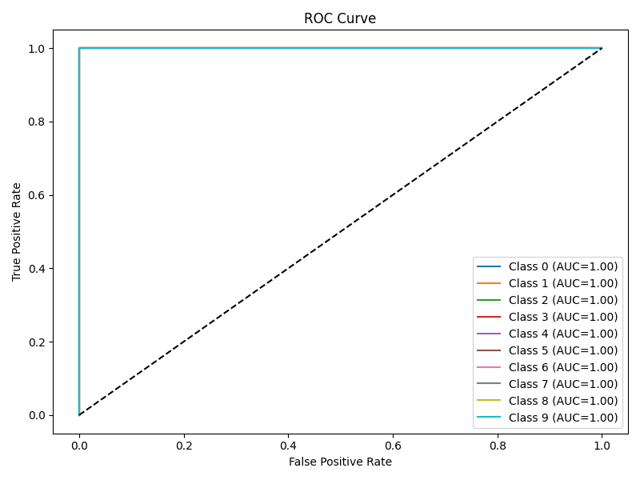
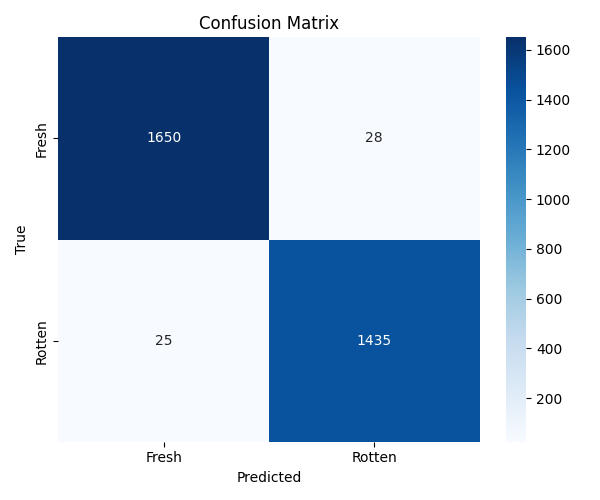
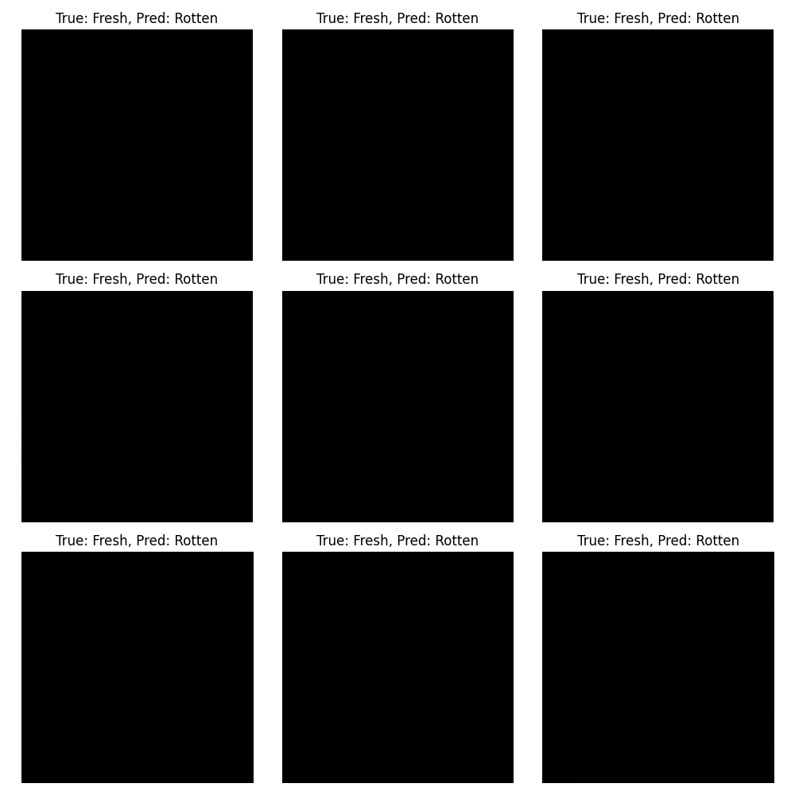
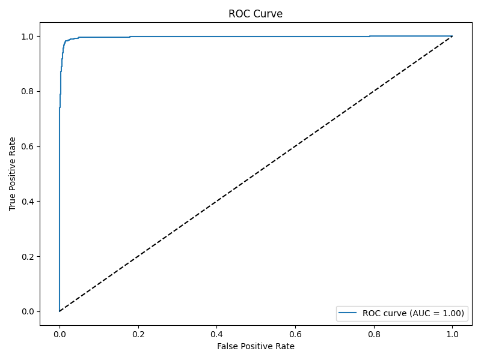

[](https://github.com/ellerbrock/open-source-badges/)

Badge [source](https://shields.io/)

# Image-Based-Food-Freshness-Prediction-System

Image Based Food Freshness Prediction System is an image classification project that is designed to classify the fruits and vegetables and the freshness of fruits and vegetables based on image data using a convolutional neural network (CNN) model built with TensorFlow. The application provides a web interface for users to upload a picture or use a webcam to click the image so that it predicts the name of the fruit or vegetable and whether it is Fresh or Rotten. Apple, Banana, Mango, Orange, Strawberry are the fruits the app can predict, and Bellpepper, Carrot, Cucumber, Potato, Tomato are the Vegetables the app can predict.

Hugging Face Spaces Gradio App link : [https://huggingface.co/spaces/samithcs/Image-Based-Food-Freshness-Prediction-System](https://huggingface.co/spaces/samithcs/Image-Based-Food-Freshness-Prediction-System)

Hugging Face Models link :

- [https://huggingface.co/samithcs/Classifier_Fruits_Vegetables](https://huggingface.co/samithcs/Classifier_Fruits_Vegetables)
- [https://huggingface.co/samithcs/Category_Classifier](https://huggingface.co/samithcs/Category_Classifier)

## Authors

- [Samith Chimminiyan](https://www.github.com/samithcsachi)

## Table of Contents

- [Authors](#Authors)
- [Table of Contents](#table-of-contents)
- [Problem Statement](#problem-statement)
- [Tech Stack](#tech-stack)
- [Data source](#data-source)
- [Quick glance at the results](#quick-glance-at-the-results)
- [Limitation and what can be improved](#limitation-and-what-can-be-improved)
- [Lessons Learned and Recommendations](#lessons-learned-and-recommendations)
- [Run Locally](#run-locally)
- [Explore the notebook](#explore-the-notebook)
- [Contribution](#contribution)
- [License](#license)

## Problem Statement

The rapid deterioration of fruits and vegetables due to improper storage, handling, and delayed identification of spoilage presents a significant challenge across the food supply chain. Traditional manual inspection methods are often inconsistent, labor-intensive, and prone to human error, leading to avoidable food waste and economic loss. There is a need for an automated, efficient, and reliable system capable of accurately assessing the freshness of produce in real time using objective data.

This project aims to address this problem by developing a computer vision-based deep learning solution that can classify the freshness of fruits and vegetables from images. By leveraging Convolutional Neural Networks (CNNs) to analyze visual characteristics, the system provides instant, accurate predictions for both the type of item and its state (Fresh or Rotten). Such a tool can empower retailers, distributors, and consumers to make informed decisions, reduce waste, and enhance food safety throughout the supply chain.

## Tech Stack

- Python
- TensorFlow
- OpenCV
- Pillow
- Fastapi
- Gradio
- Sklearn

## Data Source

Data Source Link : - [https://www.kaggle.com/datasets/muhriddinmuxiddinov/fruits-and-vegetables-dataset](https://www.kaggle.com/datasets/muhriddinmuxiddinov/fruits-and-vegetables-dataset)

- This dataset contains two folders: Fruits (5997 images for 10 classes) and Vegetables (6003 images for 10 classes) each of the above folders contains subfolders for different fruits and vegetables wherein the images for respective food items are present

## Quick glance at the results














Freshness Model (MobileNetV2 Transfer Learning):

- Training accuracy: 98.62%
- Validation accuracy: 98.10%
- Test Accuracy: 98.31%
- Test Loss: 0.0645

Category Model (MobileNetV2 Transfer Learning):

- Training Accuracy: 99.86% (Epoch 21)
- Validation Accuracy: 99.94%
- Test Accuracy: 99.91%
- Test Loss: 0.0024

## Limitations and what can be improved

- Limitations:

  - Dataset Diversity: The current model is trained on a limited set of fruit and vegetable categories, which may limit its generalizability to produce types not represented in the dataset.

  - Image Quality Dependency: Prediction accuracy relies on the quality of the input image (lighting, angle, resolution, background). Poor image conditions can negatively impact detection and classification.

  - Edge Cases and Minor Spoilage: The model may struggle to detect early or minor signs of spoilage, as these subtle changes are harder to capture and classify.

  - Real-time Integration: The system does not currently support real-time camera integration or deployment on mobile/edge devices.

  - Environment Sensitivity: The model has not been extensively tested across various environmental conditions—such as different light settings, temperatures, or packaging—which may affect its robustness.

  - Binary Classification: The Fresh/Rotten output is binary and does not reflect degrees of freshness or specific types of spoilage.

  - Explainability: The decision-making process of the model is not easily interpretable for end-users or operators without a technical background.

- What Can Be Improved

  - Expand Dataset: Incorporate more diverse types of produce and real-world images to improve the model’s robustness and adaptability.

  - Multi-class and Multi-label Classification: Upgrade the system to predict degrees of freshness and specific spoilage types (e.g., mold, bruising).

  - Real-time and Edge Deployment: Optimize the model and pipeline for deployment on mobile devices and embedded systems for practical use in stores or warehouses.

  - Explainability & Transparency: Integrate explainable AI techniques, such as Grad-CAM or saliency maps, to visualize what the model focuses on during its predictions.

  - Continuous Learning: Set up a pipeline for incremental learning so that the model can be regularly updated with new data and feedback.

  - Integration with IoT: Link the system with IoT sensors and monitoring devices to automate freshness tracking and alerts.

## Lessons Learned and Recommendations

- Lessons Learned

  - Transfer Learning with MobileNetV2: Leveraging pre-trained architectures like MobileNetV2 dramatically improved training efficiency and model accuracy, especially with a limited dataset. Transfer learning proved essential to achieve high performance without requiring massive amounts of labelled data.

  - Data Augmentation: Applying augmentation techniques (rotation, flipping, brightness/contrast changes) increased the robustness of the model against variations in image quality and environmental conditions but opted out because it was effecting the model performance

  - Early Stopping and Learning Rate Scheduling: Implementing early stopping guards against overfitting by halting training when the validation loss ceases to improve. Dynamic learning rate scheduling ensures more stable convergence during training, allowing the model to more effectively reach optimal solutions.

  - Regularization: Techniques like dropout and weight decay are critical for preventing overfitting, especially in models trained on relatively small datasets but opted out because it was effecting the model performance

- Recommendations

  - Broader Dataset Acquisition: Invest in collecting a more comprehensive dataset covering various produce types, handling conditions, and storage environments for broader applicability.

  - Advanced Augmentation: Consider more sophisticated augmentation, such as synthetic data generation or GAN-based approaches for rare spoilage scenarios.

  - Model Explainability: Integrate explainability tools (e.g., Grad-CAM) to help users and stakeholders understand model decisions and build trust.

  - Continuous Monitoring and Retraining: Set up feedback loops to capture new data and edge cases, enabling periodic retraining for improved accuracy and adaptability.

  - Edge Deployment Optimization: Focus future iterations on lightweight model architectures and quantization strategies for practical deployment on mobile or embedded devices.

  - Integration Workflow: Develop user-friendly interfaces (web, mobile), possibly leveraging frameworks like FastAPI and Gradio, for seamless real-world application and adoption.

  - Mobile App Development for Real-Time Detection: Build a dedicated mobile application capable of detecting fruit and vegetable types and assessing their freshness in real time using a smartphone camera. This will make the solution highly accessible and practical for use by consumers, retailers, and supply chain professionals.

## Run Locally

Initialize git

```bash
git init
```

Clone the project

```bash
git clone https://github.com/samithcsachi/Image-Based-Food-Freshness-Prediction-System.git
```

Change the Directory

```bash
cd E:/Image-Based-Food-Freshness-Prediction-System

```

Create a virtual environment

```bash
python -m venv venv

```

```bash
.\venv\Scripts\activate
```

Install the requirements

```bash
pip install -r requirements.txt
```

Run the FAST API

```bash

python -m uvicorn src.api.main:app --reload --host 0.0.0.0 --port 8000

```

Run the app

```bash
python -m src.app.app
```

## Explore the notebook

GitHub : [https://github.com/samithcsachi/Image-Based-Food-Freshness-Prediction-System](https://github.com/samithcsachi/Image-Based-Food-Freshness-Prediction-System)

Kaggle : [https://www.kaggle.com/datasets/muhriddinmuxiddinov/fruits-and-vegetables-dataset](https://www.kaggle.com/datasets/muhriddinmuxiddinov/fruits-and-vegetables-dataset)

## Contribution

Pull requests are welcome! For major changes, please open an issue first to discuss what you would like to change or contribute.

## License

MIT License

Copyright (c) 2025 Samith Chimminiyan

Permission is hereby granted, free of charge, to any person obtaining a copy
of this software and associated documentation files (the "Software"), to deal
in the Software without restriction, including without limitation the rights
to use, copy, modify, merge, publish, distribute, sublicense, and/or sell
copies of the Software, and to permit persons to whom the Software is
furnished to do so, subject to the following conditions:

The above copyright notice and this permission notice shall be included in all
copies or substantial portions of the Software.

THE SOFTWARE IS PROVIDED "AS IS", WITHOUT WARRANTY OF ANY KIND, EXPRESS OR
IMPLIED, INCLUDING BUT NOT LIMITED TO THE WARRANTIES OF MERCHANTABILITY,
FITNESS FOR A PARTICULAR PURPOSE AND NONINFRINGEMENT. IN NO EVENT SHALL THE
AUTHORS OR COPYRIGHT HOLDERS BE LIABLE FOR ANY CLAIM, DAMAGES OR OTHER
LIABILITY, WHETHER IN AN ACTION OF CONTRACT, TORT OR OTHERWISE, ARISING FROM,
OUT OF OR IN CONNECTION WITH THE SOFTWARE OR THE USE OR OTHER DEALINGS IN THE
SOFTWARE.

Learn more about [MIT](https://choosealicense.com/licenses/mit/) license

## Contact

If you have any questions, suggestions, or collaborations in data science, feel free to reach out:

- 📧 Email: [samith.sachi@gmail.com](mailto:samith.sachi@gmail.com)
- 🔗 LinkedIn: [www.linkedin.com/in/samithchimminiyan](https://www.linkedin.com/in/samithchimminiyan)
- 🌐 Website: [https://samithcsachi.github.io/](https://samithcsachi.github.io/)
